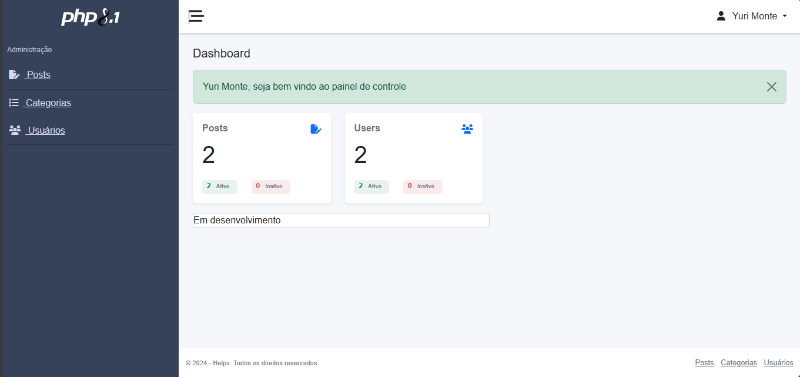
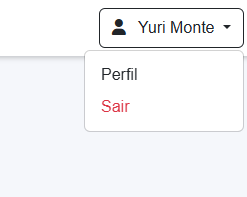
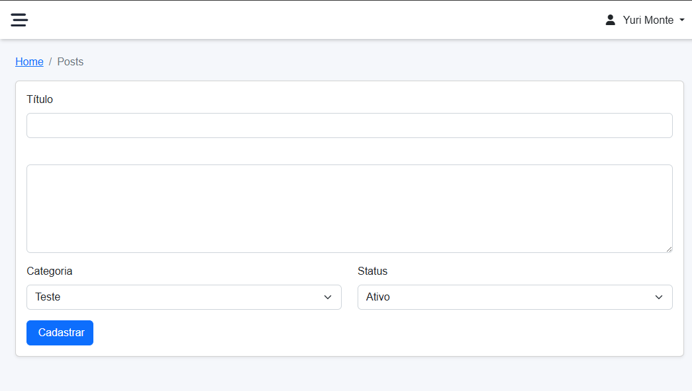
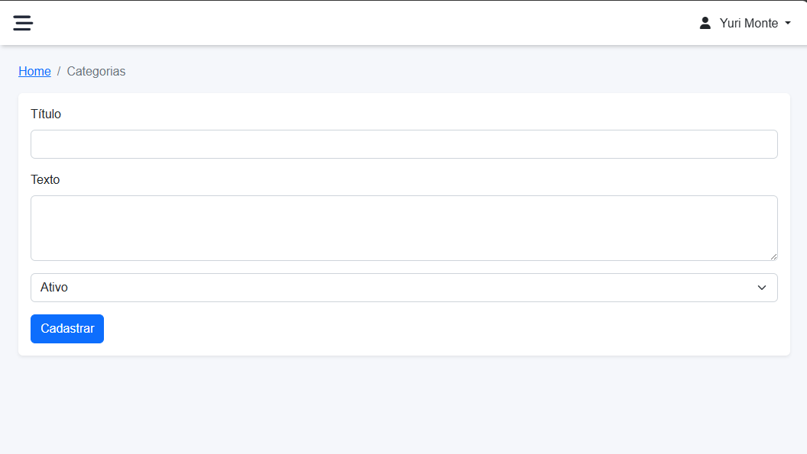
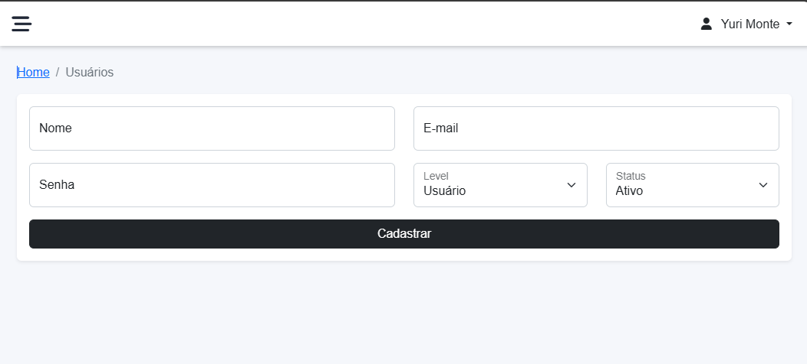

# Curso da Udemy para criação de blog com PHP 🚀
# Link do curso: https://www.udemy.com/course/curso-de-php-8-do-zero/?couponCode=KEEPLEARNING

## ➡️ Funcionalidades do Código

1. **CRUD de  Usuario, Postagens, Categoria:** 
2. **Condições de validações:** 

## ➡️ Telas da Aplicação

